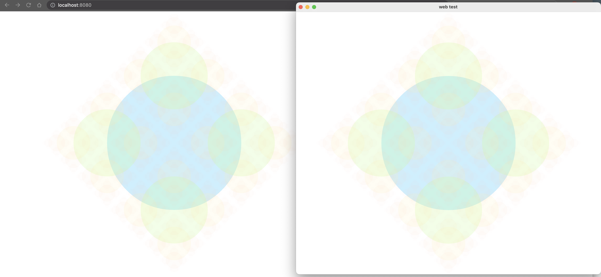

# Nannou Web App template

This repository is a template for building [Nannou](https://github.com/nannou-org/nannou) app both for native app and web browser.

Based on Rust-webpack-template repository. https://github.com/rustwasm/rust-webpack-template/tree/master/template

Also referred to Woyten's Microwave for integrating nannou for web. https://woyten.github.io/microwave/launcher.html .
https://github.com/nannou-org/nannou/pull/811/files .




## files

```
src/
    lib.rs
    main.rs <- contains entrypoint for native app
    sketch.rs <- actual nannou sketch
    web_main.rs <- contains entrypoint for web app
```

Default sketch is derived from https://github.com/nannou-org/nannou/blob/master/nature_of_code/chp_08_fractals/8_3_recursion.rs .

Because the entrypoint for web app needs to be asynchronous, some functions in the sketch are also `async function`.

If you not familier with `async` and `await` in rust, see [Async Book](https://rust-lang.github.io/async-book/) documentation, though it is not necessary to fully understand as long as you just make a sketch on nannou.

```rust
pub async fn run_app(model: Model) {
    // Since ModelFn is not a closure we need this workaround to pass the calculated model
    thread_local!(static MODEL: RefCell<Option<Model>> = Default::default());

    MODEL.with(|m| m.borrow_mut().replace(model));

    app::Builder::new_async(|app| {
        Box::new(async move {
            create_window(app).await;
            MODEL.with(|m| m.borrow_mut().take().unwrap())
        })
    })
    .backends(Backends::PRIMARY | Backends::GL)
    .update(update)
    .run_async()
    .await;
}
```

## How to install

```sh
npm install
```

## How to run in debug mode(for native app)

```sh
cargo run
```
## How to run in debug mode(for browser)

```sh
# Builds the project and opens it in a new browser tab. Auto-reloads when the project changes.
npm start
```

## How to build in release mode(for browser)

```sh
# Builds the project and places it into the `dist` folder.
npm run build
```

## How to run unit tests

```sh
# Runs tests in Firefox
npm test -- --firefox

# Runs tests in Chrome
npm test -- --chrome

# Runs tests in Safari
npm test -- --safari
```

## What does each file do?

* `Cargo.toml` contains the standard Rust metadata. You put your Rust dependencies in here. You must change this file with your details (name, description, version, authors, categories)

* `package.json` contains the standard npm metadata. You put your JavaScript dependencies in here. You must change this file with your details (author, name, version)

* `webpack.config.js` contains the Webpack configuration. You shouldn't need to change this, unless you have very special needs.

* The `js` folder contains your JavaScript code (`index.js` is used to hook everything into Webpack, you don't need to change it).

* The `src` folder contains your Rust code.

* The `static` folder contains any files that you want copied as-is into the final build. It contains an `index.html` file which loads the `index.js` file.

* The `tests` folder contains your Rust unit tests.


# License

MIT license under (c)Tomoya Matsuura 2022.

